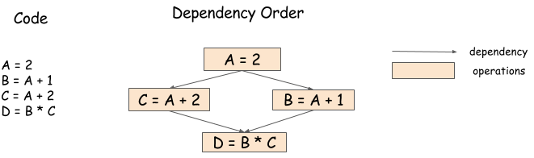

class: center, middle, inverse

<style>
table {
border: 1px solid #999;
}
td {
background: #eee;
padding: 5px 10px;
}

div.left {
width: 49%;
margin: 0;
float: left;
text-align: left;
}

div.right {
width: 49%;
margin: 0;
float: right;
text-align: left;
}

div.right h3 {
text-align: left;
}

.suc {
color: yellow;
text-weight: bold;
background: green;
}

.done {
color: black;
background: grey;
}

.head3 {
font-weight: bold;
font-size: large;
text-align: left;
padding: 5px;
display: block;
}

.right {
float: right;
display: block;
}

.hint {
float: right;
background: yellow;
padding: 5px;
}

::-webkit-scrollbar {
    width: 12px;
}
.remark-slide-scaler {
overflow-y: scroll;
}

</style>


# mxnet::engine 介绍
<p align="center">yanchunwei@baidu</p>

---
# 功能简介

## 本质
- 一个带Dependency Scheduling的异步线程池
- 单例，统筹一个机器上所有的计算资源
    - 精确到device的线程管理

## 可解决问题

- Data Flow Dependency
- Memory Recycling

---
# Data Flow Dependency

<p align="center">

</p>

执行顺序

- A 
- C wait for A; B wait for A; 两者可并行
- D wait for B and C;

---
# Memory Recycling
<p align="center">

</p>

## 执行顺序

- A 
- C wait for A; B wait for A; 两者可并行
- `A.__del__` wait for B and C

---
# Memory Recycling
## 实际场景

- 多迭代中临时变量内存回收
    - gradient variable
      - `C.gradient -> A; C.gradient.__del__`
      - `B.gradient -> B; B.gradient.__del__`
      - 可以通过计算图分析动态插入 `__del__` 
      - engine保证局部按照依赖并发执行
    
---
# 实现原理
- 资源用Var表示
- 操作用 Opr表示
- Engine用Push来添加Opr任务


- engine内部用Var表示资源依赖
- 资源只有Read/Mutate 两种操作
- 为每个 Var 分配一个queue
  - 追踪每次的Read/Mutate操作依赖
  - 如果条件满足，则通知Opr该Var可用
  - 如果Opr操作完毕，则更新queue中的状态

---
<p align="center">

</p>

---
# 并行调度的原则

- 队列FIFO
- Var的依赖队列中
  - 相邻两个Read可并行
  - 相邻两个操作中只要存在Mutate，则必须按次序执行

比如：

```
op0: B = A + 1
op1: C = A + 2
op2: D = B + C
op3: A = D
```

--
<div class="left" id="opr1">
.head3[Opr 队列]
#+begin_script opr1

| Opr Queue | Status  | Waiting for |
|-----------|---------|-------------|
| op0       | run     | b,a         |
| op1       | pending | c,a         |
| op2       | pending | d,b,c       |
| op3       | pending | a, d        |
#+end_script
</div>

<div class="right" id="opr2">
.head3[Var队列]

#+begin_script opr2

| Var | Opr        | .        | .          |
|-----|------------|----------|------------|
| a   | op0.read   | op1.read | op3.mutate |
| b   | op0.mutate | op2.read |            |
| c   | op1.mutate | op2.read |            |
| d   | op2.mutate | op3.read |            |
#+end_script
</div>


---
# 并行调度的原则
### Var队列

#+div hint
#+/div

#+begin_script
### 任务
- <span class="suc">op0: B = A + 1</span>
- <span class="suc">op1: C = A + 2</span>
- op2: D = B + C
- op3: A = D
#+end_script


| Var | Opr              | .              | .          |
|-----|------------------|----------------|------------|
| a   | .suc[op0.read]   | .suc[op1.read] | op3.mutate |
| b   | .suc[op0.mutate] | op2.read       | .          |
| c   | .suc[op1.mutate] | op2.read       | .          |
| d   | .suc[op2.mutate] | op3.read       | .          |


### Opr 队列

| Opr Queue | Status    | Waiting for |
|-----------|-----------|-------------|
| op0       | .suc[run] | .suc[b,a]   |
| op1       | .suc[run] | .suc[c,a]   |
| op2       | pending   | .suc[d],b,c |
| op3       | pending   | a,d         |


---
# 并行调度的原则

#+div hint
#+/div

#+begin_script
### 任务
- <del>op0: B = A + 1</del>
- <del>op1: C = A + 2</del>
- op2: D = B + C
- op3: A = D
#+end_script

### Var队列

| Var | Opr              | .        | . |
|-----|------------------|----------|---|
| a   | op3.mutate       | .        |   |
| b   | op2.read         | .        |   |
| c   | op2.read         | .        |   |
| d   | .suc[op2.mutate] | op3.read | . |


### Opr 队列


| Opr Queue | Status          | Waiting for |
|-----------|-----------------|-------------|
| op0       | .done[finished] | .           |
| op1       | .done[finished] | .           |
| op2       | pending         | .suc[d],b,c |
| op3       | pending         | a,d         |

---
# 并行调度的原则

#+div hint
#+/div

#+begin_script
### 任务
- <del>op0: B = A + 1</del>
- <del>op1: C = A + 2</del>
- <span class="suc">op2: D = B + C</span>
- op3: A = D
#+end_script

### Var队列

| Var | Opr              | .        | . |
|-----|------------------|----------|---|
| a   | .suc[op3.mutate] | .        | . |
| b   | .suc[op2.read]   | .        | . |
| c   | .suc[op2.read]   | .        | . |
| d   | .suc[op2.mutate] | op3.read | . |


### Opr 队列

| Opr Queue | Status          | Waiting for                     |
|-----------|-----------------|---------------------------------|
| op0       | .done[finished] | .                               |
| op1       | .done[finished] | .                               |
| op2       | .suc[run]       | <span class="suc">d,b,c</span> |
| op3       | pending         | a,.suc[d]                       |


---
# 并行调度的原则

#+div hint
#+/div

#+begin_script
### 任务
- <del>op0: B = A + 1</del>
- <del>op1: C = A + 2</del>
- <del>op2: D = B + C</del>
- op3: A = D
#+end_script

### Var队列


| Var | Opr              | . | . |
|-----|------------------|---|---|
| a   | .suc[op3.mutate] | . | . |
| b   | .                | . | . |
| c   | .                | . | . |
| d   | op3.read         | . | . |


### Opr 队列

| Opr Queue | Status          | Waiting for |
|-----------|-----------------|-------------|
| op0       | .done[finished] | .           |
| op1       | .done[finished] | .           |
| op2       | .done[finished] | .           |
| op3       | pending         | a,.suc[d]   |

---
# 并行调度的原则

#+div hint
#+/div
#+begin_script
### 任务
- <del>op0: B = A + 1</del>
- <del>op1: C = A + 2</del>
- <del>op2: D = B + C</del>
- <span class="suc">op3: A = D</span>
#+end_script

### Var队列

| Var | Opr              | . | . |
|-----|------------------|---|---|
| a   | .suc[op3.mutate] | . | . |
| b   | .                | . | . |
| c   | .                | . | . |
| d   | .suc[op3.read]   | . | . |


### Opr 队列

| Opr Queue | Status          | Waiting for                   |
|-----------|-----------------|-------------------------------|
| op0       | .done[finished] | .                             |
| op1       | .done[finished] | .                             |
| op2       | .done[finished] | .                             |
| op3       | .suc[run]       | <span class="suc">a,d</span> |


---
# 并行调度的原则

#+div hint
#+/div
#+begin_script
### 任务
- <del>op0: B = A + 1</del>
- <del>op1: C = A + 2</del>
- <del>op2: D = B + C</del>
- <del>op3: A = D</del>
#+end_script

### Var队列


| Var | Opr | . | . |
|-----|-----|---|---|
| a   | .   | . | . |
| b   | .   | . | . |
| c   | .   | . | . |
| d   | .   | . | . |


### Opr 队列

| Opr Queue | Status          | Waiting for |
|-----------|-----------------|-------------|
| op0       | .done[finished] | .           |
| op1       | .done[finished] | .           |
| op2       | .done[finished] | .           |
| op3       | .done[finished] | .           |

---
# 代码实现细节及其他优化
## 代码结构

- [engine.h](http://www.superjom.xyz/mxnetcode/codebrowser/include/mxnet/executor.h.html#mxnet::Executor),主接口
- [engine_impl.h](http://www.superjom.xyz/mxnetcode/codebrowser/src/engine/engine_impl.h.html), 定义了 Var, Opr, VarHandle, OprHandle等概念
- [profile.h](http://www.superjom.xyz/mxnetcode/codebrowser/src/engine/profiler.h.html), profiler 记录执行信息
- [src/engine/threaded_engine.h](http://www.superjom.xyz/mxnetcode/codebrowser/src/engine/threaded_engine.h.html), 多线程engine的父类
- [src/engine/naive_engine.h](http://www.superjom.xyz/mxnetcode/codebrowser/src/engine/naive_engine.cc.html), 单线程实现，方便调试
- [src/engine/threaded_engine_pooled.cc](http://www.superjom.xyz/mxnetcode/codebrowser/src/engine/threaded_engine_pooled.cc.html),多线程engine的实现
- [src/engine/threaded_engine_perdevice.cc](http://www.superjom.xyz/mxnetcode/codebrowser/src/engine/threaded_engine_perdevice.cc.html),每个device独立线程池的实现

---
## 宏观接口
### Var Opr
```c++
/*! \brief Internal representation of variable. */
struct Var {
  template <typename T> inline T* Cast();
};
/*! \brief Internal representation of operator.  */
struct Opr {
  template <typename T> inline T* Cast();
}
/*! \brief Variable pointer type, usually hold by user used to specify dependencies. */
typedef Var* VarHandle;
/*! \brief Operator pointer type, usually hold by user.*/
typedef Opr* OprHandle;
```

---
## 宏观接口
### Engine
```c++
class Engine {
public:
/*! \brief callback on complete*/
typedef engine::CallbackOnComplete CallbackOnComplete;
/*! \brief Asynchronous operation to pass to engine. */
typedef std::function<void(RunContext, CallbackOnComplete)> AsyncFn;
// \brief Push an asynchronous operation to the engine.
virtual void PushAsync(AsyncFn exec_fun, Context exec_ctx,
                         std::vector<VarHandle> const& const_vars,
                         std::vector<VarHandle> const& mutable_vars,
                         FnProperty prop = FnProperty::kNormal,
                         int priority = 0,
                         const char* opr_name = nullptr) = 0;
};
```

---
## 参数依赖管理代码实现
参数依赖大部分逻辑放在 `Var` 的实现 `ThreadedVar` 中
### [ThreadedVar](http://www.superjom.xyz/mxnetcode/codebrowser/src/engine/threaded_engine.h.html)

[VersonedVarBlock](http://www.superjom.xyz/data/symbol.html?root=../mxnetcode/&ref=mxnet::engine::VersionedVarBlock)

- 每个Var 的 Opr 队列使用链表构建
- 链表中的节点类型为 `VersonedVarBlock`
- 链表为 `ThreadedVar`

```c++
struct VersonedVarBlock {
  VersonedVarBlock* next;
  OprBlock* trigger;
  bool write{false};
};
```

---
```c++
class ThreadedVar final : public Var, \
    public common::ObjectPoolAllocatable<ThreadedVar> {

public:

inline void AppendReadDependency(OprBlock* opr_block);
inline void AppendWriteDependency(OprBlock* opr_block);

template <typename Dispatcher>
inline void CompleteReadDependency(Dispatcher dispatcher);

template <typename Dispatcher>
inline bool CompleteWriteDependency(Dispatcher dispatcher);

private:
  // 队列中下一个 write 操作的 opr 记录
  // 链表开头
  VersionedVarBlock* pending_write_{nullptr};
  // 链表结尾
  VersionedVarBlock* head_{nullptr};
  
  // 如果 pending_write_ 非空，则记录 pending_write_ 后面接的 Read 操作的数目
  int num_pending_reads_{0};
  
};
```

---
name: var-control-tpl
## 参数依赖管理代码实现
---
template: var-control-tpl
### [ThreadedOpr](http://www.superjom.xyz/mxnetcode/codebrowser/src/engine/threaded_engine.h.html#mxnet::engine::ThreadedOpr)
- 存储需要执行的 opr 必要的信息

```c++
struct ThreadedOpr file : public Opr {
  Engine::AsyncFn fn;
};
```
---
template: var-control-tpl
### [OprBlock](http://www.superjom.xyz/mxnetcode/codebrowser/src/engine/threaded_engine.h.html#mxnet::engine::OprBlock)
- 存储异步执行必要信息

```c++
struct OprBlock {
  // 等待操作的 ThreadedVar 的个数
  std::atomic<int> wait{0}:

  // 每个依赖的 ThreadedVar ready，则调用之
  // 当 wait == 0 时，表示该 OprBlock 可以被 dispatch 执行
  inline int decr_wait() {
    // chack invariant, avoid over trigger
    int ret = --wait;
    CHECK_GE(ret, 0);
    return ret;
  }
};
```
---
name: threaded-var-tpl
## ThreadedVar
---
template: threaded-var-tpl
### [AppendReadDependency](http://www.superjom.xyz/mxnetcode/codebrowser/src/engine/threaded_engine.cc.html#_ZN5mxnet6engine11ThreadedVar20AppendReadDependencyEPNS0_8OprBlockE)

```c++
inline void ThreadedVar::AppendReadDependency(OprBlock* opr_block) {
  std::lock_guard<std::mutex> lock{m_};
  // 队列里没有Write，则当前参数直接ready
  if (pending_write_ == nullptr) {
    // STATE CHANGE
    ++num_pending_reads_;
    // decrease wait counter
    opr_block->decr_wait();
  } else {
    auto&& new_var_block = VersionedVarBlock::New();
    // append things to next.
    head_->next = new_var_block;
    head_->trigger = opr_block;
    head_ = new_var_block;
  }
}
```

---
template: threaded-var-tpl
### [AppendWriteDependency](http://www.superjom.xyz/mxnetcode/codebrowser/src/engine/threaded_engine.cc.html#_ZN5mxnet6engine11ThreadedVar21AppendWriteDependencyEPNS0_8OprBlockE)

- 创建新 `VersionedVarBlock` 
- 追加到链表 `head` 后
- 如果当前 `pending_write == nullptr`，则更新 `pending_write`

---
template: threaded-var-tpl
### CompleteReadDependency

```c++
template <typename Dispatcher>
inline void ThreadedVar::CompleteReadDependency(Dispatcher dispatcher) {
  OprBlock *trigger = nullptr;
  {
    std::lock_guard<std::mutex> lock{m_};
 
    // 如果 最近的write 前没有read操作，则直接 dispatch write操作
    if (--num_pending_reads_ == 0) {
      if (pending_write_ != nullptr) {
        // STATE CHANGE
        trigger = pending_write_->trigger;
        num_pending_reads_ = kWriteTriggered;
      }
    }
  }
  if (trigger != nullptr && trigger->decr_wait() == 0) {
    dispatcher(trigger);
  }
}
```

---
template: threaded-var-tpl
### [CompleteWriteDependency](http://www.superjom.xyz/mxnetcode/codebrowser/src/engine/threaded_engine.cc.html#102)

- Write依赖完成，队列中可能跟着多个Read依赖
- 遍历队列，找到下个 Write依赖，更新 `pending_write_`
    - 记录 `pending_write_` 前Read依赖的个数，设置 `num_pending_reads_`
    - 将 `pending_write_` 前的所有 Read依赖设置 ready


---
template: threaded-var-tpl
### 总结

- ThreadedVar 实现了参数依赖管理的逻辑

---
## Engine
### [Push()](http://www.superjom.xyz/mxnetcode/codebrowser/src/engine/threaded_engine.cc.html#_ZN5mxnet6engine14ThreadedEngine4PushEPNS0_3OprENS_7ContextEib) 往 ThreadVar 追加依赖关系

```c++
void ThreadedEngine::Push(OprHandle op, Context exec_ctx, int priority, bool profiling) {
  ThreadedOpr* threaded_opr = ThreadedOpr::CastFromBase(op);
  OprBlock* opr_block = OprBlock::New();
  opr_block->opr = threaded_opr;
 
  opr_block->wait.store(static_cast<int>(
      threaded_opr->const_vars.size() +
      threaded_opr->mutable_vars.size() + 1));
  opr_block->ctx = exec_ctx;
  opr_block->priority = priority;
  opr_block->profiling = profiling;
  ++pending_;
  // Add read dependencies.
  for (auto&& i : threaded_opr->const_vars) {
    i->AppendReadDependency(opr_block);
  }
  // Add write dependencies.
  for (auto&& i : threaded_opr->mutable_vars) {
    i->AppendWriteDependency(opr_block);
  }
  if (opr_block->decr_wait() == 0) {
    this->PushToExecute(opr_block, true);
  }
}
```

---
## Engine
### [PushToExecute()](http://www.superjom.xyz/mxnetcode/codebrowser/src/engine/threaded_engine.h.html#_ZN5mxnet6engine14ThreadedEngine15ExecuteOprBlockENS_10RunContextEPNS0_8OprBlockE) 计算的具体执行

- ThreadedEnginePooled 和 ThreadedEnginePerDevice 由不同实现
- 都会调用 ExecuteOprBlock

```c++
  void ExecuteOprBlock(RunContext run_ctx, OprBlock *opr_block) {
    ThreadedOpr* threaded_opr = opr_block->opr;
    CallbackOnComplete callback = this->CreateCallback(
                    ThreadedEngine::OnCompleteStatic, opr_block);
    ...
    threaded_opr->fn(run_ctx, callback);
    ...
  }
```

- 执行OprBlock里具体的计算任务 `fn`
- 调用Engine特定的回调函数 `CallbackOnComplete`


---
## Engine
### [OnComplete](http://www.superjom.xyz/mxnetcode/codebrowser/src/engine/threaded_engine.cc.html#_ZN5mxnet6engine14ThreadedEngine10OnCompleteEPNS0_11ThreadedOprE) 回调
- 在 OprBlock 执行完毕调用，更新 ThreadedVar中Read/Write依赖队列状态
- 根据 Read/Mutate 依赖，分别调用
  - CompleteReadDependency
  - CompleteWriteDependency

---
## Engine 总结
### 逻辑
- 维护一套 ThreadedVar 
- Push 追加opr的所有参数依赖
- opr 在所有参数依赖满足后，用 `PushToExecute` 执行
- opr 执行完毕，调用 `OnComplete` 更新 ThreadedVar 中剩余的参数依赖的状态

### 特点
- 任务队列，有序
- 无需条件变量

---
## [ThreadedEnginePooled](http://www.superjom.xyz/data/symbol.html?root=../mxnetcode/&ref=mxnet::engine::ThreadedEnginePooled)
- 继承 ThreadedEngine
- DoExecute,DoPushToQueue 具体实现
- 两个线程池

```c++
dmlc::ConcurrentBlockingQueue<OprBlock*> task_queue_;
dmlc::ConcurrentBlockingQueue<OprBlock*> io_task_queue_;
ThreadPool thread_pool_;
ThreadPool io_thread_pool_;

void DoPushToQueue(OprBlock* opr_block) {
  switch (opr_block->opr->prop) {
    case FnProperty::kCopyFromGPU:
    case FnProperty::kCopyToGPU: {
      io_task_queue_.Push(opr_block);
      break;
    }
    default: {
      task_queue_.Push(opr_block);
      break;
    }
  }
}
```

---
name: threaded-engine-per-tpl
## [ThreadedEnginePerDevice](http://www.superjom.xyz/mxnetcode/codebrowser/src/engine/threaded_engine_perdevice.cc.html)
---
template: threaded-engine-per-tpl

- 任务队列+线程池封装

```c++
template<dmlc::ConcurrentQueueType type>
struct ThreadWorkerBlock {
  // task queue on this task
  dmlc::ConcurrentBlockingQueue<OprBlock*, type>  task_queue;
  // thread pool that works on this task
  std::unique_ptr<ThreadPool> pool;
  // destructor
  ~ThreadWorkerBlock() noexcept(false) {
    task_queue.SignalForKill();
  }
};
```

---
template: threaded-engine-per-tpl

```c++
// cpu worker
common::LazyAllocArray<ThreadWorkerBlock<kWorkerQueue> > 
      cpu_normal_workers_;
// cpu priority worker
std::unique_ptr<ThreadWorkerBlock<kPriorityQueue> > 
      cpu_priority_worker_;
// workers doing normal works on GPU
common::LazyAllocArray<ThreadWorkerBlock<kWorkerQueue> > 
      gpu_normal_workers_;
// workers doing copy works from/to GPU
common::LazyAllocArray<ThreadWorkerBlock<kCopyQueue> > 
      gpu_copy_workers_;
```

- `cpu_priority_worker_` 不区分dev

### [PushToExecute](http://www.superjom.xyz/mxnetcode/codebrowser/src/engine/threaded_engine_perdevice.cc.html#_ZN5mxnet6engine23ThreadedEnginePerDevice13PushToExecuteEPNS0_8OprBlockEb)
- `dev_id` 分配到对应device的线程池

---
## Engine
### [CreateEngine](http://www.superjom.xyz/mxnetcode/codebrowser/src/engine/engine.cc.html#_ZN5mxnet6engine12CreateEngineEv) 工厂函数

```c++
inline Engine* CreateEngine() {
  const char *type = getenv("MXNET_ENGINE_TYPE");
  const bool default_engine = (type == nullptr);
  if (type == nullptr) type = "ThreadedEnginePerDevice";
  std::string stype = type;

  Engine *ret = nullptr;
  #if MXNET_PREDICT_ONLY == 0
  if (stype == "NaiveEngine") {
    ret = CreateNaiveEngine();
  } else if (stype == "ThreadedEngine") {
    ret = CreateThreadedEnginePooled();
  } else if (stype == "ThreadedEnginePerDevice") {
    ret = CreateThreadedEnginePerDevice();
  }
  #else
  ret = CreateNaiveEngine();
  #endif

  return ret;
}
```
---
## Engine 在mxnet中的使用
### 相关资源的协调
以下三种资源使用Engine::Var管理

- [Resource](http://www.superjom.xyz/mxnetcode/codebrowser/include/mxnet/resource.h.html#mxnet::Resource)
  - Temp Space，临时空间
  - Random， 随机数生成器
- [NDarray::Chunk](http://www.superjom.xyz/mxnetcode/codebrowser/include/mxnet/ndarray.h.html#_ZN5mxnet7NDArray5ChunkC1Ev)，NDArray 存储的内存块

---
- [Resource](http://www.superjom.xyz/mxnetcode/codebrowser/include/mxnet/resource.h.html#mxnet::Resource)

```c++
struct ResourceRequest {
  enum Type {
    kRandom,
    kTempSpace
  };
};

struct Resurce {
  ResourceRequest req;
  engine::VarHandle var;
};
```
- [NDarray::Chunk](http://www.superjom.xyz/mxnetcode/codebrowser/include/mxnet/ndarray.h.html#_ZN5mxnet7NDArray5ChunkC1Ev)

```c++
struct Chunk {
 Chunk() : static_data(true), delay_alloc(false) {
      var  = Engine::Get()->NewVariable();
    }
};
```
---
## Engine 在mxnet中使用

### ndarray
- 每个op 都会用 `Engine::Get()->PushSync` 执行具体的计算
  - 可参考其中 [NDArray::BinaryOp](http://www.superjom.xyz/mxnetcode/codebrowser/src/ndarray/ndarray.cc.html#215)
- CPU <-> GPU 内存复制
  - 参考[NDArray::CopyFromTo](http://www.superjom.xyz/mxnetcode/codebrowser/src/ndarray/ndarray.cc.html#_ZN5mxnet10CopyFromToERKNS_7NDArrayEPS0_i)


---
### GraphExecutor

- Graph中所有op使用engine 执行
    - 参考 [GraphExecutor::RunOps](http://www.superjom.xyz/mxnetcode/codebrowser/src/executor/graph_executor.cc.html#1217)

    ```c++
    for (size_t nid = topo_start; nid < topo_end; ++nid) {
      // ...
      Engine::Get()->Push(seg_op.opr, seg_op.ctx, 0, profiling);
      // ...
    }
    ```

---
### KVStore
- 参数服务器中 Pull/ Push 中使用engine执行
  - 参考  [KVStoreDist::Push](https://github.com/dmlc/mxnet/blob/master/src/kvstore/kvstore_dist.h#L82)

```c++
    CHECK_NOTNULL(Engine::Get())->PushAsync(
        pull_from_servers,
        pinned_ctx_,
        {},
        {recv_buf.var()},
        FnProperty::kNormal,
        priority,
        PROFILER_MESSAGE("KVStoreDistPull"));
```
